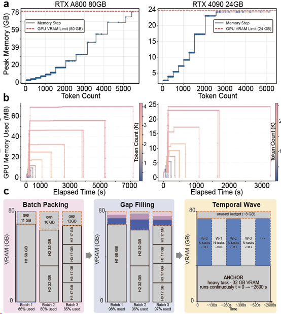

# AF3Parallel

[](https://pypi.org/project/af3parallel/)
[](LICENSE)
[](https://www.python.org/downloads/)
[](https://github.com/google-deepmind/alphafold3)

Profile-driven toolkit for running [AlphaFold 3](https://github.com/google-deepmind/alphafold3) inference at scale on multi-GPU Linux clusters.

AF3Parallel wraps the official AF3 Singularity workflow with VRAM-aware scheduling, temporal-wave batching, and companion utilities for profiling, runtime estimation, and input JSON preparation. Install from **PyPI** and invoke all tools through a single CLI.

**PyPI:** https://pypi.org/project/af3parallel/

---

## Overview

Profile-driven VRAM scheduling on A800 80 GB and RTX 4090 24 GB: stepwise peak-memory profiles (**a**), runtime memory traces (**b**), and batch packing with temporal-wave gap filling (**c**).



---

## What's included

| Tool | CLI command | Purpose |
| --- | --- | --- |
| Multi-GPU executor | `af3parallel run` | Distribute AF3 jobs across GPUs with LPT scheduling, VRAM-aware batching, and temporal-wave packing |
| Peak VRAM profiler | `af3parallel profile` | One-shot peak-memory scan → TSV profile for scheduling |
| Time-series profiler | `af3parallel profile-ts` | Sub-second VRAM sampling during AF3 runs |
| GPU runtime estimator | `af3parallel estimate-gpu` | Predict serial GPU wall time from a token profile |
| CPU/MSA estimator | `af3parallel estimate-cpu` | Predict data-pipeline wall time from a protein-length profile |
| JSON integrator | `af3parallel json` | Batch-edit AF3 inputs (seeds, ligands, nucleic acids, ions) |
| GPU monitor | `af3parallel monitor` | Standalone `nvidia-smi` memory logger |

Built-in VRAM/runtime profiles are **measured** on NVIDIA A800 80 GB and RTX 4090 24 GB; other GPUs require a one-time custom profile from `af3parallel profile`.

---

## Installation

### Prerequisites

Complete the [official AF3 v3.0.1 installation](https://github.com/google-deepmind/alphafold3/blob/v3.0.1/docs/installation.md) first (Singularity image, model weights, genetic databases). Details: [docs/installation.md](docs/installation.md).

| Component | Required | Notes |
| --- | --- | --- |
| AlphaFold 3 v3.0.1 + Singularity | Yes | Run from your AF3 working directory |
| Linux + NVIDIA GPU (CC ≥ 8.0) | Yes | e.g. A100, H100, RTX 4090 |
| Python ≥ 3.8 | Yes | Core tools use the standard library |
| `psutil` | Optional | Auto `--max-concurrent-tasks` in `af3parallel run` |
| `rdkit` | Optional | More accurate SMILES heavy-atom counts |

### pip

```bash
pip install "af3parallel[extras]"
```

Verify:

```bash
af3parallel --version
af3parallel --help
```

---

## Quick start

Run from your AF3 working tree (`alphafold3/`):

```bash
# 1. Profile once per GPU model (skip for built-in a800-80g / rtx4090)
af3parallel profile \
    -i ./profile_inputs -o my_gpu_profile.tsv \
    --sif alphafold3.sif --af3-db ~/af3_DB --models ./models

# 2. (Optional) estimate batch runtime
af3parallel estimate-gpu \
    --input-dir ./af_input --profile my_gpu_profile.tsv \
    --output-tsv estimate_breakdown.tsv --workers 16

# 3. Run the batch across all GPUs
af3parallel run \
    -i ./af_input -o results.tsv --output-dir ./af_output \
    --sif alphafold3.sif --af3-db ~/af3_DB --models ./models \
    --gpus 0,1,2,3 --memory-profile my_gpu_profile.tsv
```

Dry-run: `af3parallel run ... --test-only`

Bulk ligand replacement (directory of JSON files, in place):

```bash
af3parallel json replace-ligand \
    --input-dir ./inputs --in-place \
    --target-id L \
    --smiles "CC(=O)Nc1ccc(O)cc1" \
    --ligand-tag paracetamol \
    --workers 8
```

Applies the same replacement to every `*.json` in `./inputs`; files are updated atomically in place.

---

## Typical workflow

```
  AF3 input JSONs  ──►  af3parallel profile  ──►  TSV profile
         │                                              │
         │                                              ▼
         ├──►  af3parallel estimate-gpu/cpu             │
         │                                              ▼
         └──────────────────────────────►  af3parallel run  ──►  results.tsv
```

See [docs/workflow.md](docs/workflow.md).

---

## CLI reference

```bash
af3parallel <command> [arguments]
af3parallel run --help
python -m af3parallel --help
```

| Subcommand | Standalone alias |
| --- | --- |
| `run` | `af3parallel-run` |
| `profile` | `af3parallel-profile` |
| `profile-ts` | `af3parallel-profile-ts` |
| `estimate-gpu` | `af3parallel-estimate-gpu` |
| `estimate-cpu` | `af3parallel-estimate-cpu` |
| `json` | `af3parallel-json` |
| `monitor` | `af3parallel-monitor` |

Full flags: [docs/cli-reference.md](docs/cli-reference.md)

---

## Features

- Token-balanced **LPT** multi-GPU distribution
- **VRAM-aware** batching with temporal-wave scheduling
- Built-in profiles for **A800 80 GB** and **RTX 4090 24 GB**
- Streaming TSV logs, per-task retry, SIGINT cleanup
- Optional `psutil` CPU-RAM autocap and `rdkit` SMILES parsing

---

## Documentation

| Topic | Guide |
| --- | --- |
| [docs/README.md](docs/README.md) | Documentation index |
| [docs/installation.md](docs/installation.md) | Install & prerequisites |
| [docs/workflow.md](docs/workflow.md) | End-to-end workflow |
| [docs/gpu-profiles.md](docs/gpu-profiles.md) | GPU presets & profile TSV |
| [docs/cli-reference.md](docs/cli-reference.md) | CLI flags & outputs |
| [docs/json-integrator.md](docs/json-integrator.md) | Input JSON editor |
| [docs/tips.md](docs/tips.md) | Tips & troubleshooting |

---

## License & citation

MIT License — see [LICENSE](LICENSE). AlphaFold 3 is licensed separately by Google DeepMind.

> Abramson, J., Adler, J., Dunger, J. *et al.* Accurate structure prediction of biomolecular interactions with AlphaFold 3. *Nature* **630**, 493–500 (2024). https://doi.org/10.1038/s41586-024-07487-w

See [CITATION.cff](CITATION.cff).
